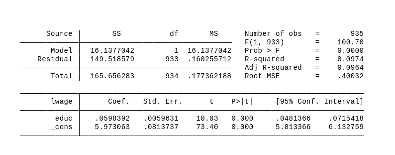
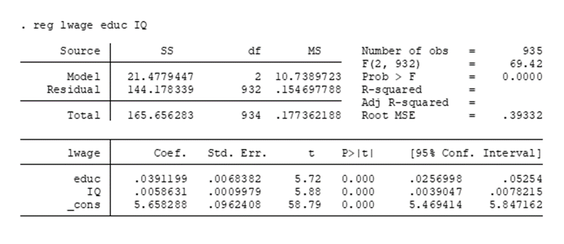
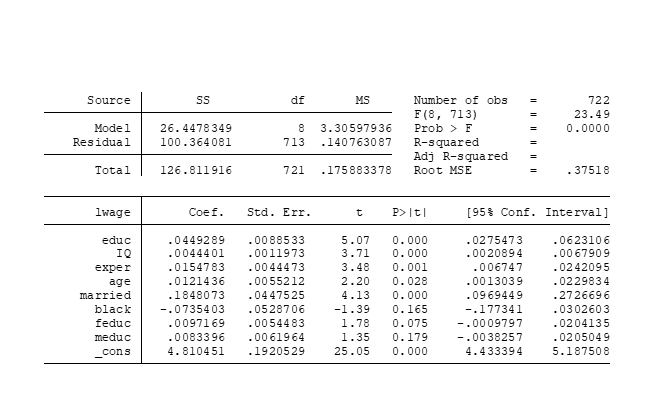

```{r setup, include=FALSE}
knitr::opts_chunk$set(echo = TRUE, warning = FALSE, message = FALSE)
```

**Entregable**: Un archivo PDF (R-Markdown) contestando correctamente a las preguntas abajo presentadas, así como el archivo `.Rmd`. Ambos archivos deben subirse a GitHub antes de la fecha límite, grabados con su nombre.

---

> **⚙️ Paso 1 — Cómo crear tu proyecto en RStudio (hazlo una sola vez)**
>
> 1. Acepta la tarea en el link que te compartió el profesor → se crea tu repositorio personal en GitHub
> 2. Entra a tu repositorio → click en el botón verde **"Code"** → copia la URL (termina en `.git`)
> 3. Abre RStudio → `File` → `New Project` → `Version Control` → `Git`
> 4. Pega la URL → elige una carpeta en tu computadora → click `Create Project`
> 5. Verifica que ves `ps2_estudiante.Rmd` en el panel de archivos (esquina inferior derecha)
>
> A partir de aquí, **siempre abre el Problem Set (PS) desde ese proyecto** (`File` → `Open Project`), no desde el archivo directamente.

---

> **📤 Paso 2 — Cómo guardar tu avance en GitHub (hazlo cada vez que avances)**
>
> Guardar en tu computadora (`Ctrl+S`) **no** sube los cambios a GitHub. Para que el profesor y el asistente vean tu trabajo debes hacer:
>
> 1. Panel **Git** en RStudio (esquina superior derecha) → verás tus archivos modificados con una **M**
> 2. Marca el **checkbox** junto a `ps2_estudiante.Rmd` (y el `.pdf` si ya compilaste)
> 3. Click **Commit** → escribe un mensaje descriptivo, por ejemplo: `"avance I.a y I.b"`
> 4. Click **Push** → tus cambios aparecen en GitHub
>
> **Recomendación:** haz commit y push al terminar cada pregunta, no solo al final.
> Así queda registro de tu progreso y puedes recuperar versiones anteriores si algo falla.

---

> **📌 Paso 3 — Protocolo de uso de IA (Claude)**
>
> Antes de consultar al tutor IA, escribe en un comentario dentro de tu bloque de código:
>
> ```
> # CONSULTA IA
> # 1. Qué intento hacer:
> # 2. Error o resultado inesperado que obtuve:
> # 3. Lo que ya intenté:
> ```
> Tienes **5 consultas por sesión**. La IA no escribirá tu código — te hará preguntas para que llegues a la respuesta tú mismo.

---

## I. Griliches (1977) en una investigación muy influyente intenta determinar los "Retornos a la educación" en EE. UU. Es decir, cuánto contribuye un año más de educación formal al sueldo en dólares. Algunas de las variables que utilizó son las siguientes:

| Variable | Descripción |
|----------|-------------|
| wage | Sueldo mensual en dólares |
| lwage | Logaritmo del Sueldo mensual en dólares |
| educ | Años de educación. |
| exper | Años de experiencia laboral |
| IQ | Coeficiente Intelectual en puntos (Media de 100 puntos, DS de 15 puntos) |
| age | Edad del individuo en años |
| Married = 1 | Si se encuentra Casado. |
| Black = 1 | Si el individuo es de raza negra. |
| meduc | Educación de la madre en años. |
| Feduc | Educación del padre en años. |

El autor, primero obtiene la siguiente regresión:



### a. Interprete el coeficiente de educ.

*[Tu respuesta aquí]*

### b. Interprete el coeficiente ajustado de determinación (Adj R-squared).

*[Tu respuesta aquí]*

### c. Interprete la constante en el modelo.

*[Tu respuesta aquí]*

Posteriormente, el autor estima la siguiente regresión:



### a. Interprete el coeficiente de IQ.

*[Tu respuesta aquí]*

### b. ¿En cuánto porciento aumenta el ingreso promedio si el IQ aumenta en una Desviación Estándar (DS)?

*[Tu respuesta aquí]*

### c. Demuestre formalmente/matemáticamente, por qué el coeficiente de *educ* es menor que el obtenido en la primera regresión.

*[Tu demostración en LaTeX aquí]*

Ahora obtenemos el modelo integrando todas las variables explicativas.



### i. ¿Es este modelo mejor describiendo la variación en sueldos que el modelo anterior? Estime manualmente R^2^-ajustada en ambos modelos.

```{r r2-ajustada-manual}
# TU CÓDIGO
# Usa los valores de SS (Model, Residual, Total) y los grados de libertad
# que aparecen en cada tabla de regresión para calcular R2 y R2-ajustada a mano.
```

*[Tu respuesta aquí]*

### ii. Interprete el coeficiente de *exper*. ¿La no inclusión de esta variable sesgaba el resultado anterior de *educ*? ¿Es posible saber si el sesgo es "hacia arriba" o "hacia abajo" con los resultados de esta regresión? ¿Es posible establecerlo teóricamente?

*[Tu respuesta aquí]*

### iii. ¿Por qué al autor le interesaría controlar por la educación de los padres del individuo *i* si su interés es el de estudiar la relación de la educación del individuo *i* con su sueldo?

*[Tu respuesta aquí]*

### iv. Formalmente, describa la relación entre educación de los padres con la del individuo y demuestre la dirección del sesgo (teórico).

*[Tu demostración en LaTeX aquí]*

---

## II. ¿Cuáles son los supuestos clásicos SLR y MLR analizados hasta el momento? Escríbalos formalmente y descríbalos brevemente con palabras.

*[Tu respuesta aquí]*

---

## III. Copie el siguiente Código en R:

```{r simulacion-insesgamiento}
#Clear the environment
rm(list = ls())

#help
help(rnorm)

#Lets create some variables!
set.seed(1234567) #good practice for when working with random vars (reproducibility)

x <- rnorm(1000) #1000 random obs

y <- matrix((5000 + 100*x) + rnorm(1000 * 500, mean = 0, sd = 1), ncol = 500) #Y = bo + b1x + u

y <- data.frame(y)

#this loop renames i column names of Y matrix
for (i in 1:ncol(y)){
  colnames(y)[i] <- paste0("y", i)
}

#Run 500 regressions!
betas <- 1:500 #create an empty object with 500 entries to be filled with the B1s

for (i in 1:ncol(y)){ #This loop runs 500 regressions Yi on X for i=1 to 500
  betas[i] <- summary(
    lm(y[, i] ~ x))$coefficients[2, 1] #extracts the coefficient beta 1 from the matrix of results provided by R
}
```

### a. Paste the average of all the estimated betas 1

```{r promedio-betas}
# TU CÓDIGO
```

### b. Paste the histogram for estimated betas 1

```{r histograma-betas}
# TU CÓDIGO
```

### c. The Gauss-Markov Theorem states that under the classical assumptions OLS is BLUE (Best Linear Unbiased Estimator). Do the summary statistics and histogram from parts a. and b. suggest that the OLS estimator is unbiased? Explain why.

*[Tu respuesta aquí]*

### d. Explain which parts of the code above guarantees that Gauss-Markov assumptions hold.

*[Tu respuesta aquí]*

---

## IV. Use el código de abajo y cambie el número de observaciones de 100, a 10,000, y a 100,000.

```{r consistencia-n100}
set.seed(1234567)
x     <- rnorm(100) #100 random obs
resid <- rnorm(100, mean = 0, sd = 10) #random error

y <- (20 + 2*x + resid)

model <- lm(y ~ x)
summary(model)
```

```{r consistencia-n10000}
# TU CÓDIGO — repite el bloque anterior con n = 10,000
```

```{r consistencia-n100000}
# TU CÓDIGO — repite el bloque anterior con n = 100,000
```

### a. Show the three summary results and discuss why beta is consistent.

*[Tu respuesta aquí]*

### b. Explain why, formally, (use a formula!) the standard error of beta converges to zero when n tends to infinite.

*[Tu demostración en LaTeX aquí]*

### c. Transform the code above to show that a higher variance of x reduces the standard error of beta.

```{r varianza-x}
# TU CÓDIGO
```

*[Tu respuesta aquí]*

### d. By construction, in the code above the residual is centered around zero. Let's artificially change this. Keep n=100 and change the resid term in the code above to a mean of 20. What is the constant now? Is B~1-~hat biased?

```{r resid-media-20}
# TU CÓDIGO
```

*[Tu respuesta aquí]*

### e. Draw a scatterplot (with a fitted line) for regressions in part IV.a. (n=100) and in part IV.d. What are your conclusions regarding the estimation of B~1~?

```{r scatter-comparacion}
# TU CÓDIGO
```

*[Tu respuesta aquí]*

---

## VI. Ejecute el siguiente código

```{r sesgo-variable-omitida}
#Clear the environment
rm(list = ls())

repet <- 1000
n <- 1000
beta <- NULL

set.seed(1234567)

for (i in 1:repet){
  x1 <- rnorm(n, mean = 50, sd = 10)
  x2 <- (rnorm(n, mean = 5, sd = 30) + .1*x1)
  u  <- (rnorm(n, mean = 0, sd = 1))

  y = 2 + 2*x1 + 10*x2 + u # we define y, so that beta1=2 and beta2=10.

  beta[i] <- lm(y ~ x1)$coef[2]
}

hist(beta, main = "suit yourself, n=1000", xlim = c(0, 8))
abline(v = mean(beta), col = "red", lwd = 3, lty = 2)
abline(v = 2, col = "blue", lwd = 3, lty = 2)
```

### a. Ligue las líneas de código que considere relevantes con los supuestos MLR pertinentes. Describa un supuesto clave que se está analizando y demuestre matemáticamente por qué el estimador B~1~ es sesgado/insesgado e inconsistente/consistente.

*[Tu respuesta aquí — incluye tu demostración en LaTeX]*

### b. Modifique el código arriba para estimar: E(B~1~-hat)=B~1~

```{r correccion-sesgo}
# TU CÓDIGO
```

---

## VII. Resuelva los ejercicios 7 y 16 correspondientes al capítulo 2 de Wooldridge ed. 7.

*[Tu respuesta aquí]*

---

## VIII. Wooldridge Data in R.

### a. Use the database "bwght". Obtain the regression of birth weight in ounces on cigarettes consumption per day. Use as controls log(cigprice), and mothereduc. Interpret the B0 and B1 coefficients.

```{r bwght-nivel}
library(wooldridge)
data("bwght")

# TU CÓDIGO
```

*[Tu interpretación de B0 y B1 aquí]*

### b. Run the same regression using the log of birthweight as dependent. Interpret the coefficient B0 and B1.

```{r bwght-log}
# TU CÓDIGO
```

*[Tu interpretación de B0 y B1 aquí]*

---

## IX. Demuestre matemáticamente que en un modelo Log -- Level: %∆Y = ∆X (β~1~\*100) y que un modelo Level -- Log: : ∆Y = %∆X (β~1~/100)

*[Tu demostración en LaTeX aquí]*

---

```{r session-info, echo=FALSE}
cat("Entregado:", format(Sys.time(), "%Y-%m-%d %H:%M"), "\n")
```
